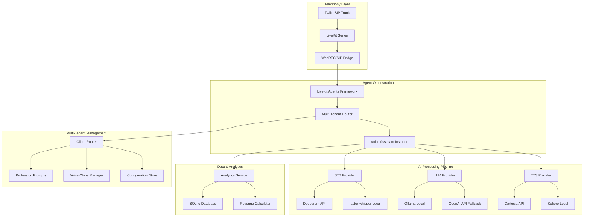
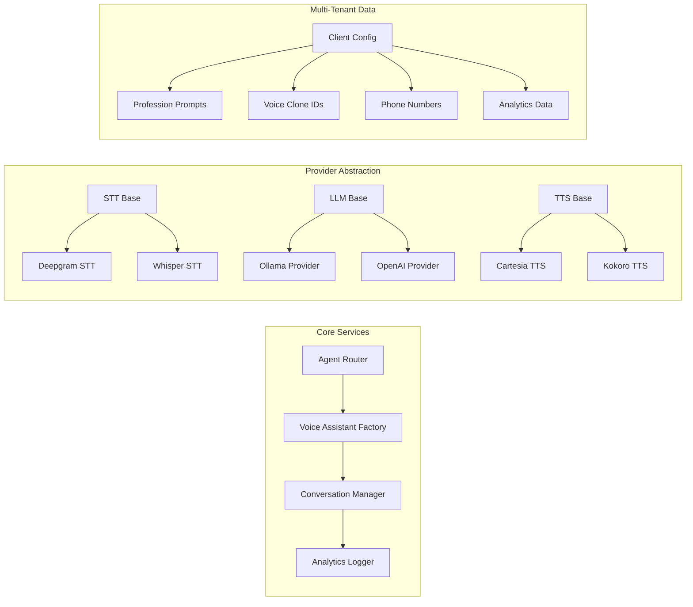

# AI Voice Agent Backend - Design Document

## Overview

The AI Voice Agent Backend is a multi-tenant, profession-specific voice AI system that powers the Ultimate AI Receptionist SaaS. It orchestrates real-time voice conversations using local LLM inference (Ollama + Llama3), swappable STT/TTS providers, and LiveKit for telephony integration. The system supports multiple business professions with custom prompts, voice cloning, and comprehensive analytics.

This design implements a hybrid local/cloud architecture optimized for sub-800ms latency while maintaining cost efficiency through local inference and swappable providers.

## Architecture

### High-Level Architecture



### Component Architecture



## Components and Interfaces

### 1. Multi-Tenant Router

**Purpose:** Routes incoming calls to the correct client configuration and profession-specific agent.

```python
class MultiTenantRouter:
    def route_call(self, phone_number: str) -> ClientConfig:
        """Route incoming call to correct client configuration"""

    def get_client_config(self, client_id: str) -> ClientConfig:
        """Retrieve client configuration including profession, voice, prompts"""

    def validate_subscription(self, client_id: str) -> bool:
        """Verify client subscription is active"""
```

**Key Responsibilities:**
- Phone number to client mapping
- Subscription status validation
- Configuration loading
- Call rejection for inactive clients

### 2. Voice Assistant Factory

**Purpose:** Creates profession-specific voice assistant instances with appropriate providers.

```python
class VoiceAssistantFactory:
    def create_assistant(self, config: ClientConfig) -> VoiceAssistant:
        """Create configured voice assistant for client"""

    def get_stt_provider(self, provider_type: str) -> BaseSTTProvider:
        """Factory method for STT providers"""

    def get_llm_provider(self, model_config: dict) -> BaseLLMProvider:
        """Factory method for LLM providers"""

    def get_tts_provider(self, voice_config: dict) -> BaseTTSProvider:
        """Factory method for TTS providers"""
```

### 3. Provider Base Classes

**STT Provider Interface:**
```python
class BaseSTTProvider(ABC):
    @abstractmethod
    async def transcribe_stream(self, audio_stream: AsyncIterator[bytes]) -> AsyncIterator[str]:
        """Transcribe streaming audio to text"""

    @abstractmethod
    async def get_latency_metrics(self) -> dict:
        """Return latency and performance metrics"""
```

**LLM Provider Interface:**
```python
class BaseLLMProvider(ABC):
    @abstractmethod
    async def generate_response(self, prompt: str, system_prompt: str, history: list) -> str:
        """Generate response with conversation history"""

    @abstractmethod
    async def stream_response(self, prompt: str, system_prompt: str) -> AsyncIterator[str]:
        """Stream response tokens for low latency"""
```

**TTS Provider Interface:**
```python
class BaseTTSProvider(ABC):
    @abstractmethod
    async def synthesize_stream(self, text: str, voice_id: str) -> AsyncIterator[bytes]:
        """Synthesize text to streaming audio"""

    @abstractmethod
    async def clone_voice(self, audio_sample: bytes) -> str:
        """Clone voice from audio sample, return voice_id"""
```

### 4. Analytics and Revenue Tracking

**Analytics Service:**
```python
class AnalyticsService:
    def log_call_start(self, call_id: str, client_id: str, caller_number: str):
        """Log call initiation"""

    def log_call_metrics(self, call_id: str, stt_latency: float, llm_latency: float, tts_latency: float):
        """Log performance metrics"""

    def log_call_end(self, call_id: str, duration: float, transcript: str, outcome: str):
        """Log call completion with transcript and outcome"""

    def calculate_revenue_value(self, transcript: str, profession: str) -> float:
        """Estimate revenue value based on conversation outcome"""
```

### 5. Conversation Manager

**Purpose:** Manages conversation state, history, and context across multiple exchanges.

```python
class ConversationManager:
    def initialize_conversation(self, client_config: ClientConfig) -> ConversationContext:
        """Initialize conversation with profession-specific context"""

    def add_exchange(self, context: ConversationContext, user_message: str, agent_response: str):
        """Add user-agent exchange to conversation history"""

    def get_context_prompt(self, context: ConversationContext) -> str:
        """Generate LLM prompt with conversation history"""

    def analyze_sentiment(self, transcript: str) -> str:
        """Analyze conversation sentiment using local LLM"""
```

## Data Models

### Client Configuration Schema

```python
@dataclass
class ClientConfig:
    client_id: str
    business_name: str
    profession: str
    phone_numbers: List[str]
    voice_clone_id: str
    system_prompt: str
    subscription_status: str
    created_at: datetime
    updated_at: datetime
```

### Call Analytics Schema

```python
@dataclass
class CallRecord:
    call_id: str
    client_id: str
    caller_number: str
    start_time: datetime
    end_time: datetime
    duration_seconds: float
    stt_latency_ms: float
    llm_latency_ms: float
    tts_latency_ms: float
    total_latency_ms: float
    transcript: str
    sentiment: str
    outcome: str
    revenue_estimate: float
```

### Profession Prompt Schema

```python
@dataclass
class ProfessionPrompt:
    profession: str
    system_prompt: str
    greeting_template: str
    qualification_questions: List[str]
    booking_flow: str
    objection_handlers: dict
    created_at: datetime
    updated_at: datetime
```

## Correctness Properties

*A property is a characteristic or behavior that should hold true across all valid executions of a system—essentially, a formal statement about what the system should do. Properties serve as the bridge between human-readable specifications and machine-verifiable correctness guarantees.*

### Property Analysis and Reflection

Based on the prework analysis from the requirements document, I've identified the following testable properties while eliminating redundancy:

**Property Consolidation:**
- Combined multiple latency properties into comprehensive end-to-end latency property
- Merged STT/TTS fallback properties into unified provider fallback property
- Consolidated conversation history properties into single round-trip property
- Combined multi-tenant isolation properties into comprehensive data isolation property

### Core System Properties

**Property 1: Call Routing Accuracy**
*For any* incoming phone number in the system, the router should map it to exactly one valid client configuration with the correct profession prompt and voice clone ID.
**Validates: Requirements 1.1, 1.2, 1.3**

**Property 2: End-to-End Latency Bounds**
*For any* voice interaction under normal system load, the total time from caller speech end to agent speech start should be less than 800ms for 95% of interactions.
**Validates: Requirements 9.1, 9.2, 9.3, 9.4**

**Property 3: Provider Fallback Resilience**
*For any* component failure (STT, LLM, or TTS), the system should automatically switch to the fallback provider and continue the conversation without dropping the call.
**Validates: Requirements 2.3, 4.4, 8.1, 8.2**

**Property 4: Multi-Tenant Data Isolation**
*For any* client in the system, all call data, analytics, and configuration should be completely isolated from other clients, with no cross-client data leakage.
**Validates: Requirements 5.1, 5.2, 5.3, 5.4**

**Property 5: Conversation History Round-Trip**
*For any* conversation, saving the complete history and retrieving it should preserve all user-agent exchanges in the correct chronological order.
**Validates: Requirements 12.1, 12.2, 12.3, 12.4, 12.5**

**Property 6: Voice Clone Consistency**
*For any* client with a voice clone, all TTS synthesis should use the correct voice ID and produce consistent voice characteristics across all responses.
**Validates: Requirements 10.1, 10.2, 10.3, 10.5**

**Property 7: Profession Prompt Application**
*For any* profession type, the LLM should receive and apply the correct profession-specific system prompt, resulting in appropriate responses for that business type.
**Validates: Requirements 6.1, 6.2, 6.3, 6.4**

**Property 8: Analytics Completeness**
*For any* completed call, the system should log all required metrics (duration, latencies, transcript, sentiment, revenue estimate) with no missing fields.
**Validates: Requirements 7.1, 7.2, 7.3, 7.4, 7.5**

**Property 9: SIP Connection Reliability**
*For any* valid SIP call from Twilio, the system should establish a WebRTC connection, maintain audio quality, and properly close the connection when the call ends.
**Validates: Requirements 11.1, 11.2, 11.3, 11.4**

**Property 10: Error Recovery Graceful Degradation**
*For any* system error or timeout, the system should either recover automatically or end the call gracefully with a professional message, never leaving callers in an undefined state.
**Validates: Requirements 8.1, 8.2, 8.3, 8.4, 8.5**

## Error Handling

### Error Categories and Responses

**1. Provider Failures**
- STT failure → Switch to fallback provider (Deepgram → faster-whisper)
- LLM failure → Switch to fallback provider (Ollama → OpenAI API)
- TTS failure → Switch to fallback provider (Cartesia → Kokoro)
- All providers fail → Play professional message and end call

**2. Network and Connectivity**
- SIP connection drop → Attempt reconnection, log partial transcript
- WebRTC issues → Fallback to different codec, maintain call quality
- API timeouts → Retry with exponential backoff (max 3 attempts)

**3. Multi-Tenant Issues**
- Unknown phone number → Reject call with professional message
- Inactive subscription → Reject call, log attempt for billing
- Configuration errors → Use default safe configuration, alert admin

**4. Performance Degradation**
- High latency detected → Switch to faster providers, reduce model complexity
- Memory pressure → Garbage collect conversation history, optimize buffers
- CPU overload → Queue calls, implement backpressure

### Error Logging and Monitoring

```python
class ErrorHandler:
    def log_error(self, error_type: str, context: dict, severity: str):
        """Structured error logging with context"""

    def trigger_fallback(self, component: str, error: Exception) -> bool:
        """Trigger fallback provider and return success status"""

    def should_retry(self, error: Exception, attempt_count: int) -> bool:
        """Determine if operation should be retried"""
```

## Testing Strategy

### Dual Testing Approach

The system uses both unit tests and property-based tests for comprehensive coverage:

**Unit Tests:**
- Specific examples demonstrating correct behavior
- Edge cases and error conditions
- Integration points between components
- Voice cloning and provider switching scenarios

**Property-Based Tests:**
- Universal properties across all inputs (100+ iterations minimum)
- Comprehensive input coverage through randomization
- Each property test references its design document property
- Tag format: **Feature: ai-voice-agent, Property {number}: {property_text}**

### Property Test Configuration

Each property test will run with:
- Minimum 100 iterations for statistical confidence
- Random generation of phone numbers, client configurations, and conversation scenarios
- Latency measurement and validation
- Provider failure simulation
- Multi-tenant data isolation verification

### Testing Infrastructure

**Local Testing:**
- Ollama with Llama3 8B model
- faster-whisper for STT
- Kokoro for TTS
- SQLite for analytics storage

**Integration Testing:**
- LiveKit server with SIP trunk simulation
- Multi-client scenario testing
- Load testing with concurrent calls
- Failover scenario testing

## Deployment Architecture

### Container Architecture

```yaml
services:
  ollama:
    image: ollama/ollama:latest
    volumes:
      - ollama_data:/root/.ollama
    deploy:
      resources:
        reservations:
          devices:
            - driver: nvidia
              count: all
              capabilities: [gpu]

  livekit:
    image: livekit/livekit:latest
    command: server --config /etc/livekit.yaml
    volumes:
      - ./livekit.yaml:/etc/livekit.yaml

  agent:
    build: .
    depends_on: [ollama, livekit]
    volumes:
      - ./data:/app/data
    environment:
      - STT_PROVIDER=whisper
      - TTS_PROVIDER=kokoro
      - OLLAMA_HOST=ollama:11434
```

### Hardware Requirements

**Minimum (Development):**
- 8-core CPU, 16GB RAM
- RTX 3060 12GB or equivalent
- 50GB SSD storage
- Performance: ~1-2 second response time

**Recommended (Production):**
- 16-core CPU, 32GB RAM
- RTX 4070/5060 or better
- 100GB NVMe SSD
- Performance: <600ms response time

**Scale (Multi-tenant):**
- Dual RTX 5090 or A6000
- 64GB RAM, 32-core CPU
- 500GB NVMe SSD
- Performance: <400ms, 100+ concurrent calls

### Network and Telephony

**SIP Configuration:**
- Twilio Elastic SIP Trunk
- LiveKit Cloud for WebRTC bridging
- Ngrok or Cloudflare Tunnel for local development
- Production: Direct server with public IP

**Latency Optimization:**
- Co-locate with SIP provider region
- Use CDN for static assets
- Implement connection pooling
- Optimize audio codec selection

## Security Considerations

### Authentication and Authorization
- JWT-based client authentication
- Phone number verification
- Subscription status validation
- Rate limiting per client

### Data Protection
- Client data isolation at database level
- Encrypted storage for voice samples
- Secure API key management
- Audit logging for all operations

### Voice Clone Security
- Voice sample encryption at rest
- Access control for voice clone APIs
- Watermarking for generated audio
- Usage tracking and limits

## Multi-Model Routing Architecture

### Complexity Classifier Logic

The system uses intelligent routing to direct queries to the optimal LLM based on complexity analysis:

#### Ollama (Local / Low-Complexity) - "Muscle"
**Target Latency:** 400-600ms | **Temperature:** 0.1 (precision mode)

**Routing Triggers:**
- Simple greetings and acknowledgments ("hello", "yes", "no", "thank you")
- Vectorization tasks and semantic clustering
- Deterministic responses requiring high precision
- System administration and container management
- Debug mode requests

**Voice Agent Use Cases:**
- Initial greeting responses
- Simple confirmations ("I'll schedule that for you")
- FAQ responses from knowledge base
- Appointment time confirmations
- Basic call routing decisions

#### WatsonX (Cloud / High-Complexity) - "Brain"
**Target Latency:** 1000-1500ms | **Temperature:** 0.7 (creative mode)

**Keyword Triggers:**
- 'research', 'build', 'plan', 'explain', 'compare'
- Multi-step patterns: "and then", "first...", "step 1"
- Complex reasoning markers

**Structural Triggers:**
- Questions with multiple clauses
- Requests requiring context synthesis
- Objection handling scenarios
- Custom booking flows

**Voice Agent Use Cases:**
- Complex appointment scheduling with constraints
- Handling customer objections
- Multi-step qualification flows
- Creative problem-solving responses
- Insurance/pricing explanations

### Classifier Implementation

```python
class ComplexityClassifier:
    """Routes queries to optimal LLM based on complexity analysis."""

    SIMPLE_PATTERNS = [
        r'^(hi|hello|hey|yes|no|ok|okay|thanks|thank you|bye|goodbye)[\s\.\!\?]*$',
        r'^(what time|when is|is .+ available|can i book|schedule).*$',
    ]

    COMPLEX_KEYWORDS = ['research', 'build', 'plan', 'explain', 'compare', 'why', 'how does']
    COMPLEX_PATTERNS = ['and then', 'first', 'step 1', 'on one hand', 'however']

    def classify(self, query: str) -> str:
        """
        Classify query complexity.

        Returns:
            'ollama' for simple queries (local, fast)
            'watsonx' for complex queries (cloud, powerful)
        """
        query_lower = query.lower().strip()

        # Check for simple patterns first (fast path)
        for pattern in self.SIMPLE_PATTERNS:
            if re.match(pattern, query_lower):
                return 'ollama'

        # Check for complexity markers
        for keyword in self.COMPLEX_KEYWORDS:
            if keyword in query_lower:
                return 'watsonx'

        for pattern in self.COMPLEX_PATTERNS:
            if pattern in query_lower:
                return 'watsonx'

        # Word count heuristic: longer queries tend to be more complex
        word_count = len(query.split())
        if word_count > 20:
            return 'watsonx'

        # Default to local for speed
        return 'ollama'
```

### Failover and Cost Tracking

```python
class LLMRouter:
    """Routes LLM requests with automatic failover and cost tracking."""

    def __init__(self):
        self.classifier = ComplexityClassifier()
        self.ollama = OllamaProvider()
        self.watsonx = WatsonXProvider()
        self.metrics = MetricsCollector()

    async def route_request(self, query: str, system_prompt: str) -> tuple[str, dict]:
        """
        Route request to optimal provider with failover.

        Returns:
            (response_text, metrics_dict)
        """
        target = self.classifier.classify(query)
        start_time = time.time()

        try:
            if target == 'ollama':
                response = await self.ollama.generate(query, system_prompt)
                provider_used = 'ollama'
            else:
                response = await self.watsonx.generate(query, system_prompt)
                provider_used = 'watsonx'

        except ProviderError as e:
            # Failover logic
            logger.warning(f"{target} failed, falling back...")
            if target == 'ollama':
                response = await self.watsonx.generate(query, system_prompt)
                provider_used = 'watsonx_fallback'
            else:
                response = await self.ollama.generate(query, system_prompt)
                provider_used = 'ollama_fallback'

        latency_ms = (time.time() - start_time) * 1000

        # Track costs
        metrics = {
            'provider': provider_used,
            'latency_ms': latency_ms,
            'query_complexity': target,
            'token_count': len(response.split()),
            'cost_usd': self._calculate_cost(provider_used, response),
        }

        self.metrics.log(metrics)
        return response, metrics

    def _calculate_cost(self, provider: str, response: str) -> float:
        """Calculate cost based on provider and token count."""
        tokens = len(response.split()) * 1.3  # Rough token estimate

        if 'ollama' in provider:
            return 0.0  # Local inference is free
        else:
            return tokens * 0.00002  # WatsonX pricing estimate
```

## Performance Optimization

### Latency Optimization
- Model quantization for faster inference
- Connection pooling for API calls
- Predictive loading of client configurations
- Audio buffer optimization
- Complexity-based routing to minimize cloud calls

### Scalability
- Horizontal scaling with load balancer
- Database sharding by client_id
- Caching layer for frequent queries
- Async processing for analytics

### Cost Optimization
- Local inference to avoid per-token costs
- Intelligent provider selection based on cost/latency
- Usage-based scaling
- Efficient resource utilization

## Monitoring and Analytics

### Real-Time Metrics
- Call volume and success rate
- Average latency per component
- Provider failure rates
- Revenue tracking per client

### Performance Dashboards
- System health monitoring
- Client usage analytics
- Cost analysis and optimization
- Capacity planning metrics

### Alerting
- High latency alerts (>1 second)
- Provider failure notifications
- Subscription expiration warnings
- System resource alerts

This design provides a robust, scalable foundation for the Ultimate AI Receptionist SaaS while maintaining the flexibility to adapt to different business requirements and scale efficiently.