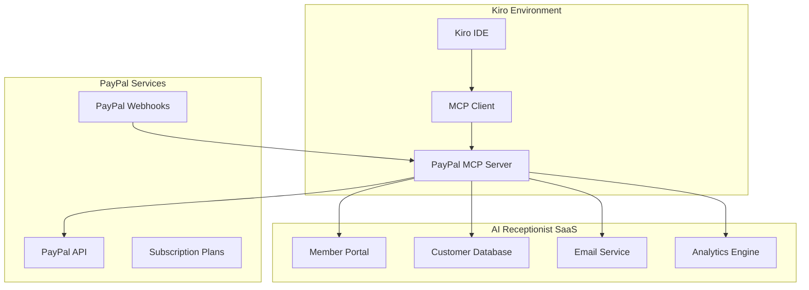

# Design Document

## Overview

This design outlines the integration of the official PayPal MCP server (https://github.com/paypal/paypal-mcp-server) into our AI Receptionist SaaS. The integration will replace our custom PayPal power with official PayPal tooling, providing robust subscription management, real-time webhook processing, and comprehensive billing automation.

The design leverages Kiro's MCP architecture to seamlessly integrate PayPal operations into our development workflow, enabling automated customer onboarding, subscription lifecycle management, and business intelligence reporting.

## Architecture

### High-Level Architecture



### Integration Flow

1. **PayPal MCP Server Setup**: Configure official PayPal MCP server in Kiro
2. **Webhook Endpoint**: Establish secure webhook processing endpoint
3. **Subscription Management**: Automate subscription lifecycle events
4. **Customer Onboarding**: Seamless flow from PayPal to Member Portal
5. **Analytics Pipeline**: Real-time business intelligence and reporting

## Components and Interfaces

### PayPal MCP Server Configuration

```json
{
  "mcpServers": {
    "paypal": {
      "command": "npx",
      "args": ["@paypal/paypal-mcp-server"],
      "env": {
        "PAYPAL_CLIENT_ID": "${PAYPAL_CLIENT_ID}",
        "PAYPAL_CLIENT_SECRET": "${PAYPAL_CLIENT_SECRET}",
        "PAYPAL_ENVIRONMENT": "${PAYPAL_ENVIRONMENT}"
      },
      "autoApprove": [
        "create_subscription",
        "get_subscription",
        "cancel_subscription",
        "list_subscriptions",
        "create_webhook",
        "get_webhook_events",
        "verify_webhook_signature"
      ]
    }
  }
}
```

### Subscription Management Interface

```typescript
interface SubscriptionManager {
  // Core subscription operations
  createSubscription(planId: string, customerId: string): Promise<Subscription>
  getSubscription(subscriptionId: string): Promise<Subscription>
  cancelSubscription(subscriptionId: string, reason: string): Promise<void>
  updateSubscription(subscriptionId: string, updates: SubscriptionUpdate): Promise<Subscription>
  
  // Plan management
  listPlans(): Promise<Plan[]>
  createPlan(planData: PlanCreate): Promise<Plan>
  updatePlan(planId: string, updates: PlanUpdate): Promise<Plan>
  
  // Customer management
  createCustomer(customerData: CustomerCreate): Promise<Customer>
  getCustomer(customerId: string): Promise<Customer>
  updateCustomer(customerId: string, updates: CustomerUpdate): Promise<Customer>
}
```

### Webhook Processing Interface

```typescript
interface WebhookProcessor {
  // Webhook validation
  verifySignature(payload: string, signature: string): boolean
  
  // Event processing
  processSubscriptionCreated(event: WebhookEvent): Promise<void>
  processSubscriptionActivated(event: WebhookEvent): Promise<void>
  processSubscriptionCancelled(event: WebhookEvent): Promise<void>
  processPaymentCompleted(event: WebhookEvent): Promise<void>
  processPaymentFailed(event: WebhookEvent): Promise<void>
  
  // Error handling
  handleWebhookError(event: WebhookEvent, error: Error): Promise<void>
  retryFailedWebhook(eventId: string): Promise<void>
}
```

### Analytics Interface

```typescript
interface AnalyticsEngine {
  // Revenue metrics
  calculateMRR(): Promise<number>
  calculateChurnRate(period: DateRange): Promise<number>
  calculateLTV(): Promise<number>
  calculateCAC(): Promise<number>
  
  // Subscription analytics
  getSubscriptionsByPlan(): Promise<PlanMetrics[]>
  getSubscriptionTrends(period: DateRange): Promise<TrendData[]>
  getCustomerSegmentation(): Promise<SegmentData[]>
  
  // Reporting
  generateRevenueReport(period: DateRange): Promise<RevenueReport>
  generateChurnReport(period: DateRange): Promise<ChurnReport>
  exportAnalytics(format: 'csv' | 'pdf'): Promise<Buffer>
}
```

## Data Models

### Subscription Model

```typescript
interface Subscription {
  id: string
  customerId: string
  planId: string
  status: 'APPROVAL_PENDING' | 'APPROVED' | 'ACTIVE' | 'SUSPENDED' | 'CANCELLED' | 'EXPIRED'
  startTime: Date
  nextBillingTime?: Date
  billingInfo: {
    outstandingBalance: number
    cycleExecutions: number
    lastPayment?: Payment
    failedPaymentsCount: number
  }
  subscriber: {
    name: string
    email: string
    payerId: string
  }
  links: PayPalLink[]
  createTime: Date
  updateTime: Date
}
```

### Plan Model

```typescript
interface Plan {
  id: string
  productId: string
  name: string
  description: string
  status: 'CREATED' | 'INACTIVE' | 'ACTIVE'
  billingCycles: BillingCycle[]
  paymentPreferences: {
    autoBillOutstanding: boolean
    setupFee?: Money
    setupFeeFailureAction: 'CONTINUE' | 'CANCEL'
    paymentFailureThreshold: number
  }
  taxes?: {
    percentage: string
    inclusive: boolean
  }
  createTime: Date
  updateTime: Date
}
```

### Customer Model

```typescript
interface Customer {
  id: string
  paypalCustomerId: string
  email: string
  name: string
  businessName?: string
  profession: string
  subscriptions: Subscription[]
  memberPortalAccess: {
    setupProgress: number
    lastLogin: Date
    features: string[]
  }
  billingAddress?: Address
  createTime: Date
  updateTime: Date
}
```

### Webhook Event Model

```typescript
interface WebhookEvent {
  id: string
  eventType: string
  resourceType: string
  summary: string
  resource: any
  eventVersion: string
  createTime: Date
  links: PayPalLink[]
}
```

## Correctness Properties

*A property is a characteristic or behavior that should hold true across all valid executions of a system—essentially, a formal statement about what the system should do. Properties serve as the bridge between human-readable specifications and machine-verifiable correctness guarantees.*

### Property 1: MCP Server Connectivity
*For any* valid PayPal credentials, the MCP server should successfully authenticate and connect to both sandbox and production environments
**Validates: Requirements 1.1, 1.2**

### Property 2: Webhook Idempotency
*For any* webhook event, processing the same event multiple times should produce the same result as processing it once
**Validates: Requirements 3.3**

### Property 3: Subscription State Consistency
*For any* subscription, when PayPal webhook events are processed, the local subscription status should always match the PayPal subscription status within 30 seconds
**Validates: Requirements 2.2, 3.1**

### Property 4: Customer Onboarding Automation
*For any* successful PayPal subscription, a corresponding customer record should be created and welcome email sent within 5 minutes
**Validates: Requirements 2.1, 4.4**

### Property 5: Security Validation
*For any* incoming webhook, requests with invalid signatures should be rejected and logged as security events
**Validates: Requirements 3.2, 7.2**

### Property 6: Billing Calculation Accuracy
*For any* subscription plan upgrade, the prorated billing amount should equal the price difference multiplied by the remaining billing period percentage
**Validates: Requirements 6.2**

### Property 7: Analytics Calculation Integrity
*For any* set of subscription events, the calculated MRR should equal the sum of all active subscription monthly values
**Validates: Requirements 5.1**

### Property 8: Plan Limit Enforcement
*For any* customer usage that exceeds plan limits, the system should notify the customer and offer upgrade options
**Validates: Requirements 6.4, 6.5**

### Property 9: Webhook Processing Performance
*For any* PayPal webhook notification, the system should process it within 30 seconds of receipt
**Validates: Requirements 3.1**

### Property 10: Member Portal Real-time Updates
*For any* subscription change, the Member Portal should reflect the updated status immediately after webhook processing
**Validates: Requirements 9.2**

### Property 11: Retry Logic Consistency
*For any* failed webhook processing, the system should retry with exponential backoff up to 5 attempts before marking as failed
**Validates: Requirements 3.5**

### Property 12: Migration Data Preservation
*For any* existing subscription during migration, all subscription data and customer relationships should be preserved exactly in the new MCP server format
**Validates: Requirements 10.3, 10.1**

## Error Handling

### PayPal API Error Handling

```typescript
class PayPalErrorHandler {
  handleAPIError(error: PayPalAPIError): ErrorResponse {
    switch (error.name) {
      case 'AUTHENTICATION_FAILURE':
        return this.handleAuthError(error)
      case 'RESOURCE_NOT_FOUND':
        return this.handleNotFoundError(error)
      case 'VALIDATION_ERROR':
        return this.handleValidationError(error)
      case 'RATE_LIMIT_REACHED':
        return this.handleRateLimitError(error)
      default:
        return this.handleGenericError(error)
    }
  }
  
  private async retryWithBackoff(operation: () => Promise<any>, maxRetries: number = 3): Promise<any> {
    for (let attempt = 1; attempt <= maxRetries; attempt++) {
      try {
        return await operation()
      } catch (error) {
        if (attempt === maxRetries) throw error
        await this.delay(Math.pow(2, attempt) * 1000) // Exponential backoff
      }
    }
  }
}
```

### Webhook Error Recovery

```typescript
class WebhookErrorRecovery {
  async handleFailedWebhook(event: WebhookEvent, error: Error): Promise<void> {
    // Log the error with context
    this.logger.error('Webhook processing failed', {
      eventId: event.id,
      eventType: event.eventType,
      error: error.message,
      timestamp: new Date()
    })
    
    // Queue for retry with exponential backoff
    await this.retryQueue.add('webhook-retry', {
      event,
      attempt: 1,
      maxAttempts: 5
    }, {
      delay: 1000,
      backoff: {
        type: 'exponential',
        settings: {
          factor: 2,
          maxDelay: 30000
        }
      }
    })
  }
}
```

## Testing Strategy

### Unit Testing
- **PayPal MCP Server Integration**: Test all MCP tool calls with mocked PayPal responses
- **Subscription Management**: Test subscription lifecycle operations with various scenarios
- **Webhook Processing**: Test webhook validation and event processing logic
- **Analytics Calculations**: Test MRR, churn, and LTV calculation accuracy
- **Error Handling**: Test error scenarios and recovery mechanisms

### Integration Testing
- **End-to-End Subscription Flow**: Test complete customer journey from PayPal signup to Member Portal access
- **Webhook Integration**: Test real webhook processing with PayPal webhook simulator
- **Member Portal Integration**: Test subscription data display and management features
- **Analytics Pipeline**: Test real-time analytics updates from subscription events

### Property-Based Testing
Each correctness property will be implemented as a property-based test with minimum 100 iterations:

```typescript
// Example property test
describe('Property 1: Subscription State Consistency', () => {
  it('should maintain consistent subscription status between PayPal and local database', async () => {
    await fc.assert(fc.asyncProperty(
      fc.record({
        subscriptionId: fc.string(),
        paypalStatus: fc.constantFrom('ACTIVE', 'CANCELLED', 'SUSPENDED'),
        webhookEvent: fc.record({
          eventType: fc.string(),
          resource: fc.object()
        })
      }),
      async ({ subscriptionId, paypalStatus, webhookEvent }) => {
        // Process webhook event
        await webhookProcessor.processEvent(webhookEvent)
        
        // Verify local status matches PayPal status
        const localSubscription = await subscriptionManager.getSubscription(subscriptionId)
        const paypalSubscription = await paypalMCP.getSubscription(subscriptionId)
        
        expect(localSubscription.status).toBe(paypalSubscription.status)
      }
    ), { numRuns: 100 })
  })
})
```

**Testing Framework**: Jest with fast-check for property-based testing
**Test Coverage Target**: 90%+ for all PayPal integration components
**Performance Testing**: Load testing for webhook processing under high volume